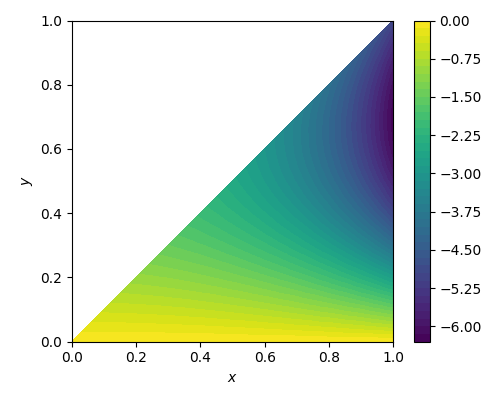

# Numerical Solution to Kernel PDEs
## Implementing a numerical solution for kernel PDEs in backstepping control of PDEs

The backstepping method is a powerful approach in controlling systems modeled by partial differential equations (PDEs). Examples of such systems include conductive heat transfer, the wave equation, and delay system. The development of this approach traces back to the works of [Liu (2003)](https://doi.org/10.1137/S0363012902402414) and [Smyshlyaev and Krstic (2004)](https://doi.org/10.1109/TAC.2004.838495). As a boundary control method, PDE backstepping has been widely studied in academia and has proven to be optimal and robust.

In this method, an integral transformation is employed to map the evolution of the control system to the solution of a target system whose stability is already demonstrated. The control problem is then reduced to finding the solution of another PDE that describes the kernel of the integral transformation, referred to as the kernel PDE.

This repository is an implementation of a numerical method proposed by [Jadachowski *et el.* (2012)](https://doi.org/10.3182/20120215-3-AT-3016.00141) to approximate the solution of the kernel PDE.

  

  The kernel function

