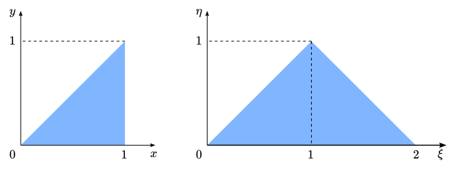
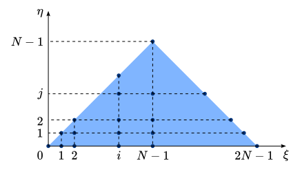

# Numerical Solution to Kernel PDEs
Consider the following parabolic partial differential equation (PDE):
$$\frac{\partial u}{\partial t} = \frac{\partial^2 u}{\partial x^2} + \lambda u$$
with boundary conditions
$$u(0, t) = 0, \\ u(1,t) = U(t)$$
where $u(x, t)$ depends on $x \in [0, 1]$ and, often interpreted as time, $t$. This equation can represent a mathematical model of a reaction-diffusion system in one spatial dimension. The constant $\lambda$ is the (linear) reaction term that can make the *system* unstable. In fact, the infinite number of the eigenvalues of the system are given by $\lambda - n^2\pi^2$ for $n = 1, 2, \cdots$, and for $\lambda > \pi^2$, the system is unstable. The control problem is to find a baoundary control $U(t)$ applied at $x = 1$ that stabilizes the system.

Through Backstepping approach, the feedback control law is found to be:
$$U(t) = \int_0^1 k(1, y) u(y, t) dy$$
where $k(x, y)$ is the solution to the Kernel PDE:
$$\frac{\partial^2 k}{\partial t^2} - \frac{\partial^2 k}{\partial y^2} = (\lambda + c) k$$
defined on the triangular domain $0 \le y \le x \le 1$ with boundary conditions:
$$k(x, 0) = 0 \\ k(x, x) = -\frac{\lambda + c}{2}x$$
In the Kernel PDE, $c$ is a tuning parameter that determines how fast the stabilizing control works.

Why is this PDE called the Kernel PDE? In Backstepping approach, an invertible integral transformation is used in the form:
$$w(x, t) = u(x, t) - \int_0^x k(x,y)u(y,t)dy$$
that maps $u(x, t)$ onto $w(x, t)$. In such transformations, $k(x,y)$ is called the kernel of transformation. $w(x, t)$ is the state variable of a *target* system whose stability is already stablished.

The following steps are considered to find a numerical solution of the Kernel function:

### Change of variables
Consider the change of variables $\xi = x + y$ and $\eta = -x + y$. The PDE takes the following form:
$$\frac{\partial^2 k(\xi, \eta)}{\partial \xi \partial \eta} = \frac{\lambda + c}{4} k(\xi, \eta) \\ k(\xi, \xi) = 0 \\ k(\xi, 0) = -\frac{\lambda + c}{4}\xi$$
Now, the second-order mixed derivative can be integrated.

  

  Kernel domain in the different variables

### Transform differential equation to integral equation
Integrate the first equation with respect to $\eta$ from $0$ to $\eta$ and apply the second boundary condition to get:
$$\frac{\partial k(\xi, \eta)}{\partial \xi} = -\frac{\lambda + c}{4} + \frac{\lambda + c}{4}\int_0^{\eta} k(\xi, \sigma)d\sigma$$
Then, integrate this equation with respect to $\xi$ from $\eta$ to $\xi$ and apply the first boundary condition to get:
$$k(\xi, \eta) = -\frac{\lambda + c}{4}(\xi - \eta) + \frac{\lambda + c}{4}\int_{\eta}^{\xi}\int_0^{\eta} k(\rho, \sigma) d\sigma d\rho$$
Now the partial differential equation has taken the form of an integral equation. 

### Discretize the domin and solve system of equations
To find an approximate solution to the integral equation numerically, the triangular spatial domain of the kernel function in $(\xi, \eta)$ coordinates is discretized into computational points on an equally-spaced square grid, as shown in the following figure. 

  

  Kernel domain discretization

Then, the integrals of the last equation are approximated by the use of the composite trapezoidal rule, given as:
$$k_{i, j} = -\frac{\lambda + c}{4}(\xi_i - \eta_j) + \frac{\lambda + c}{4}\left(\frac{h^2}{4}\right)\sum_{m=j}^{i-1}\sum_{n=0}^{j-1}\left(k_{m, n} + k_{m, n + 1} + k_{m + 1, n} + k_{m + 1, n + 1}\right)$$
where $k_{i, j} = k(\xi_i, \eta_j)$ is the value of the discretized kernel function and $h = 1 / (N - 1)$ is the grid size. Hence, the integral equation is discretized into a system of linear equations that can be solved efficiently.